# 이윤제 포트폴리오

## 1. SAP KDT 심화 2기 - RAP 개인 프로젝트

| 구분    | 내용                                                              |
| ----- | --------------------------------------------------------------- |
| 개발기간  | 2026.07 ~ 2026.09                                               |
| 프로젝트명 | S-Mobile 구매 프로세스 구축 프로젝트 (자재·공급업체·PIR·구매오더·FI계정·회계결정)             |
| 개발환경  | SAP BTP ABAP Environment, RAP(Managed, V2/V4 OData), CDS View, Fiori Elements |
| 개발인원  | 개인 프로젝트                                                         |
| 담당역할  | 6개 프로그램 설계 및 구현 - DB Table / CDS View / RAP Behavior / Fiori Elements 화면 |

### 자재관리 (Material Master)

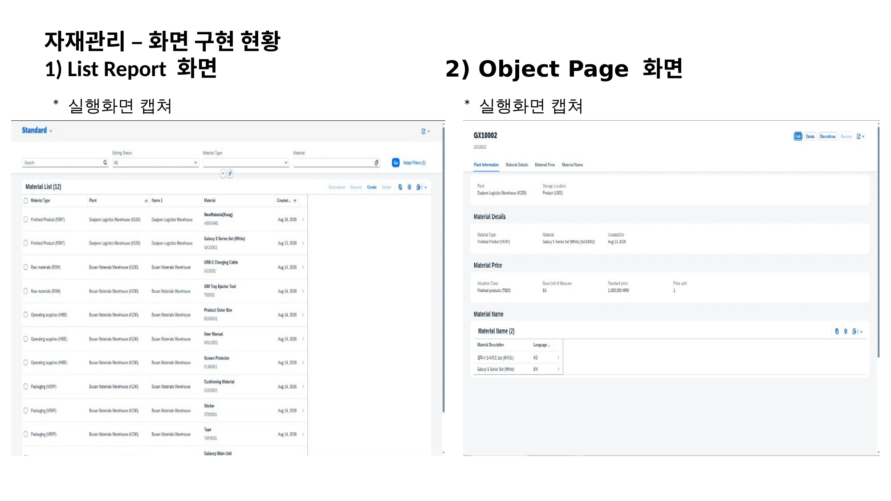

* 자재유형별 기준정보 및 다국어 자재명 관리
* FS에 없던 LVORM(사용중지) 필드를 신규 추가해, 체크 시 다른 입력 필드 전체를 Read-only로 잠그도록 구현

### 공급업체관리 (Vendor Master)

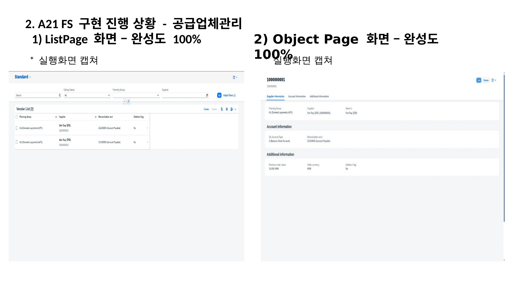

* 벤더분류·매입채무 조정계정 관리
* 조정계정(Akont) 선택 시 계정유형(Glact)을 Association으로 함께 조회
* 공급업체 분류(A1~A6)마다 시작 번호대를 다르게 하는 Number Range 채번 로직 구현
* 삭제플래그(Xloev) 체크 시 별도 액션 없이 값 저장만으로 다른 필드가 즉시 잠기도록 처리 (자재관리와 다른 방식)

### 구매정보레코드관리 (Purchasing Info Record)

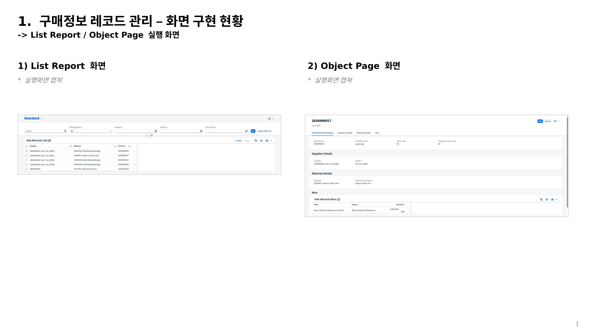

* 공급업체별 구매조건(단가·통화·주문단위) 사전관리
* 정보텍스트(Txz01) 필드를 신규 추가해 Object Page 부제목으로 활용
* 자재관리(LVORM) 상태를 실시간으로 연계 체크해, 이미 사용중지된 자재를 참조하는 정보레코드는 수정 자체를 차단 (크로스 모듈 연계)

### 구매오더관리 (Purchase Order)

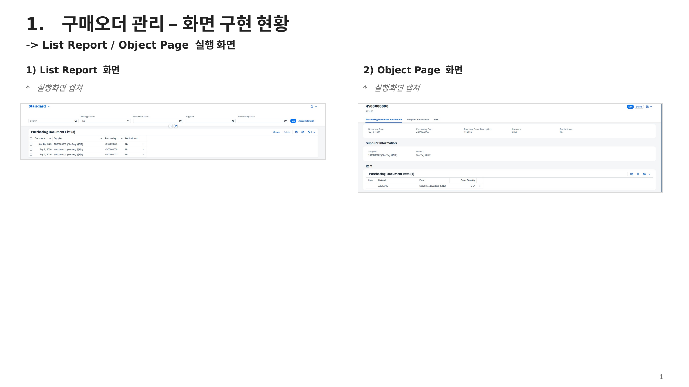

* PIR 연계 발주 생성 및 삭제 상태 관리
* 생성일(Bedat)을 시스템 날짜로 자동 설정
* 헤더→아이템 삭제 상태를 Side Effects·LINK로 실시간 전파해, 저장 없이도 관련 필드를 즉시 잠금 처리

> **트러블슈팅 - 품목번호(Ebelp) 자동 채번**
>
> 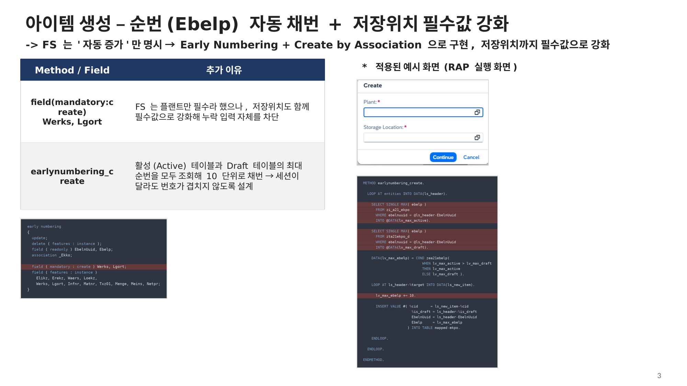
>
> 처음엔 저장할 때 번호를 채워 넣으면 될 거라고 생각했지만, RAP에서는 이미 만들어진 데이터의 키 값을 나중에 수정하는 것 자체가 불가능하다는 것을 알게 됐습니다. 품목번호(Ebelp)가 테이블의 키 값이라 저장 시점에 값을 바꾸는 방식이 허용되지 않았던 것입니다. 결국 Early Numbering + Create by Association 방식으로 바꿔서, 활성/Draft 테이블의 최댓값을 함께 조회해 세션이 달라도 번호가 겹치지 않도록 다시 설계했습니다.

### FI 계정관리 (Account Master)

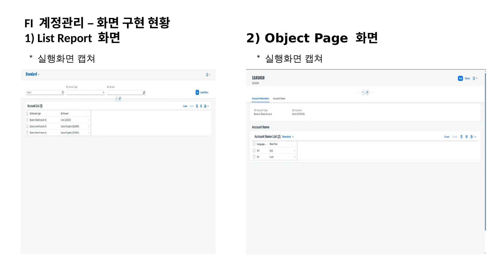

* 계정유형별 G/L 계정 마스터 관리
* FS에 없던 XLOEV(사용중지) 필드를 신규 추가

### 회계계정결정관리 (Account Determination)

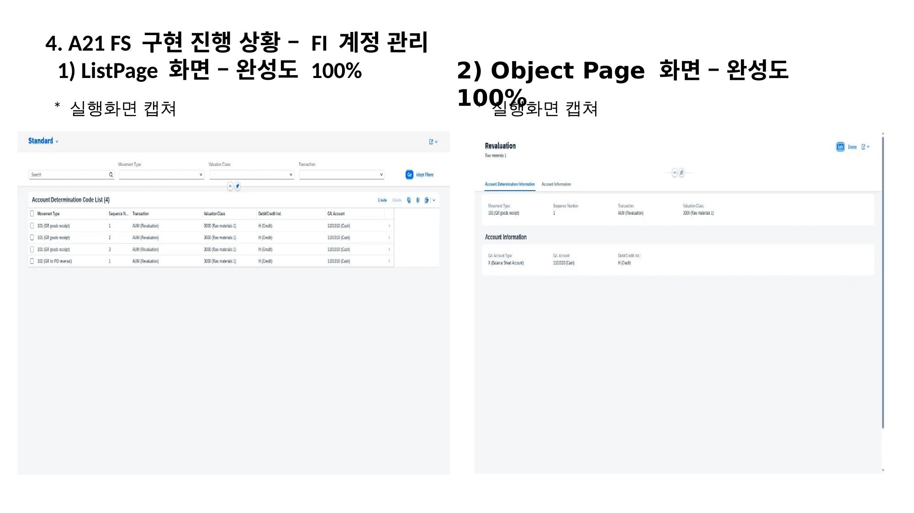

* 이동유형·거래키 기준 계정결정 규칙 관리
* 이동유형(Bwart)별로 순번(Seqnr)이 자동으로 이어지도록(최댓값+1) 채번 로직 구현

### 공통 적용 사항

* CDS 기반 Draft(V4 OData) / 비Draft(V2 OData) 시나리오 6개 프로그램 전체 동일 적용
* Text 테이블(SPRAS) + `$session.system_language` 기반 자재명·계정명 다국어(EN↔KO) 자동 조회, Validation 에러 메시지도 SE63 번역으로 동일하게 표시
* Fiori Elements Value Help(F4 CDS) 연계로 플랜트·저장위치·자재유형 등 입력 편의성 확보

---

## 2. SAP CODE 아카데미 ERP 프로젝트

| 구분    | 내용                                                            |
| ----- | ------------------------------------------------------------- |
| 개발기간  | 2026.05 ~ 2026.07                                             |
| 프로젝트명 | F&B 유통 ERP 구축 프로젝트                                            |
| 개발환경  | SAP GUI, ABAP, CDS View, Gateway/OData, Fiori/UI5, JavaScript |
| 개발인원  | 팀 프로젝트                                                        |
| 담당역할  | MM 모듈 ABAP 개발, SD 영역 Fiori/UI5 화면 개발                          |

### 포장재 자동발주 프로그램 (ZRB4MM0011)

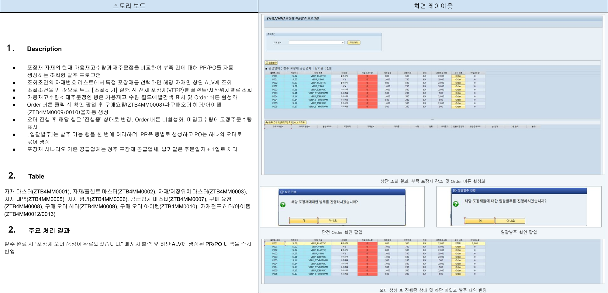

* 포장재 재고가 안전재고 이하로 떨어지면 조회 즉시 대상을 강조 표시하고, 확인 후 PR/PO를 자동 생성
* 단건 발주(Order)와 전체 일괄 발주(Order All) 두 가지 처리 방식 제공

### 통합결재 프로그램 (ZRB4MM0012)

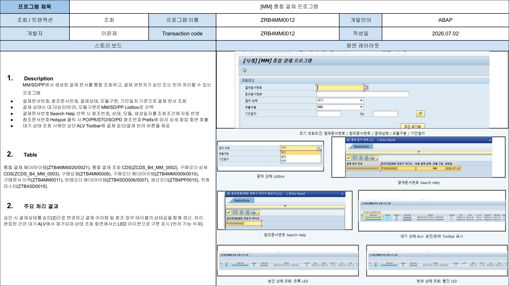

* MM/SD/PP에서 생성된 결재 문서를 통합 조회하고 승인/반려 처리
* 결재번호 채번과 참조문서 조회는 Function Module로 분리 개발하고, 승인/반려 처리 로직은 프로그램 내에서 직접 구현
* 참조문서번호 클릭 시 문서 유형(PO/PR/STO/SO/PD)에 따라 상세 팝업으로 바로 이동

### 구매오더 프로그램 (ZB4MM0011)

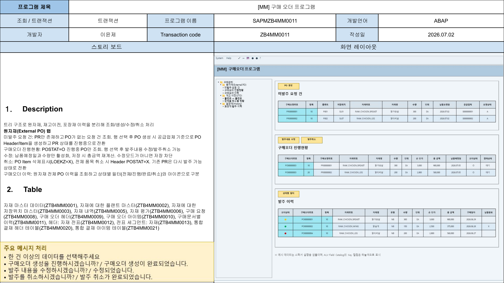

* 결재 완료된 구매요청 건에 한해 구매오더 생성, 재고이전오더(STO)도 같은 화면에서 처리
* 트리 구조로 원자재/재고이전/포장재 이력을 분리해 조회·생성·수정·취소 처리

### 입고 프로그램 (ZB4MM0012)

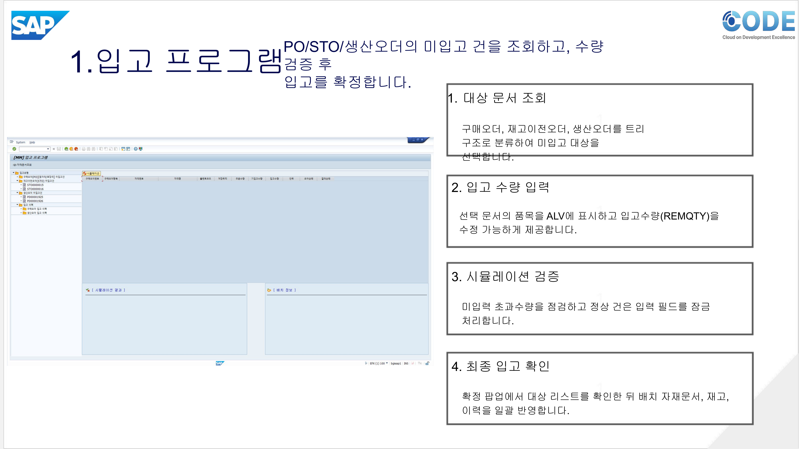

* 구매오더(PO)/재고이전오더(STO)/생산오더(PD)의 미입고 건을 트리 구조로 조회하고 입고 확정
* 배치번호 부여, 부분입고 처리, 오류 건 검증 로직 구현

> **구현 노트 - 오류 건 검증 로직**
>
> 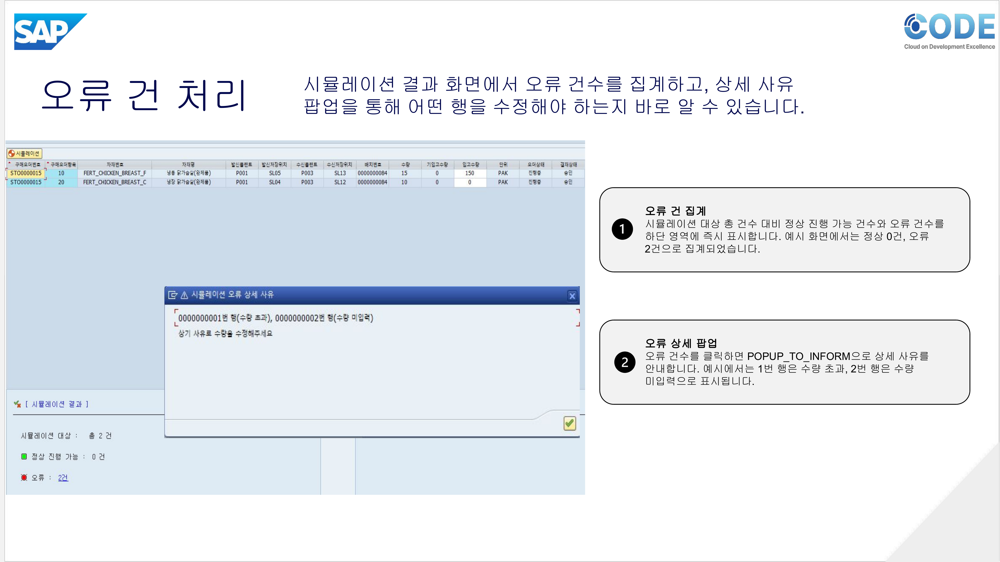
>
> 입고수량은 잔여수량 범위 안에서만 입력되도록 시뮬레이션으로 먼저 검증하고, 검증을 통과한 행은 셀 자체를 비활성화해 확정 전 임의 변경을 막았습니다. 오류가 난 행은 몇 번째 행에서 어떤 사유(수량 초과/미입력)로 걸렸는지를 팝업으로 바로 안내해서, 입고 담당자가 무엇을 고쳐야 하는지 헤매지 않도록 만들었습니다.

### 그 외 담당 기능

* 자재 유통기한 조회 프로그램 (ZRB4MM0013) - 유통기한 경과 자재 자동 조회 및 폐기 처리
* 배송관리 / 사계유통 주문 / 모바일 배송기사 앱 (Fiori/UI5) - 배송 현황 관리, 고객 주문 등록, 배송기사용 모바일 화면

---

## 3. Calogram - 영양분석 식단관리 애플리케이션

| 구분    | 내용                                                |
| ----- | ------------------------------------------------- |
| 개발기간  | 2022.03 ~ 2022.05                                 |
| 프로젝트명 | 칼로그램                                              |
| 개발환경  | Android Studio, Java, Firebase, OpenCV, Tesseract |
| 개발인원  | 4명                                                |
| 담당역할  | 운동 화면 및 칼로리 계산 기능 개발                              |

### 담당 기능

* 운동 화면 개발
* 남은 칼로리 및 태운 칼로리 출력
* METS 공식을 활용한 운동 칼로리 자동 계산 기능 구현
* 섭취 칼로리와 운동 칼로리를 비교할 수 있는 그래프 개발

---

## 4. Budget Management Work(BMW)

| 구분    | 내용                                                  |
| ----- | --------------------------------------------------- |
| 개발기간  | 2021.03.09 ~ 2021.07.01                             |
| 프로젝트명 | Budget Management Work                              |
| 개발환경  | Android Studio, Java, SQLite, Jira Software, GitHub |
| 개발인원  | 4명                                                  |
| 담당역할  | 로그인/회원가입 및 데이터베이스 관리                                |

### 담당 기능

* 로그인 기능 구현
* 회원가입 기능 구현
* SQLite를 활용한 사용자 데이터 관리

---

## 5. 다이어리 프로젝트

| 구분    | 내용                    |
| ----- | --------------------- |
| 개발기간  | 2021.03 ~ 2021.06     |
| 프로젝트명 | 다이어리 프로젝트             |
| 개발환경  | Eclipse, Java, GitHub |
| 개발인원  | 3명                    |
| 담당역할  | 로그인 및 검색/수정 기능 개발     |

### 담당 기능

* 로그인 화면 구현
* 회원가입 기능 구현
* 암호변경 기능 구현
* 검색 및 수정 기능 일부 구현

---

## 6. 부루마블 게임

| 구분    | 내용                |
| ----- | ----------------- |
| 개발기간  | 2020.03 ~ 2020.06 |
| 프로젝트명 | 부루마블 게임           |
| 개발환경  | Visual Studio, C  |
| 개발인원  | 4명                |
| 담당역할  | 게임 진행 관련 기능 개발    |

### 담당 기능

* 플레이어 이름 설정
* 현재 턴 표시
* 주사위 굴리기 기능
* 플레이어 차례 표시
* 주사위 진행 결과에 따른 시나리오 출력

---

## 사용 기술 요약

### SAP

* ABAP
* RAP (Managed, V2/V4 OData)
* CDS View
* Gateway/OData
* Fiori/UI5, Fiori Elements

### Web/App

* Java
* JavaScript
* SQL
* Android Studio
* Firebase
* SQLite

### Tool

* SAP GUI
* SAP BTP ABAP Environment
* VS Code
* Eclipse
* Visual Studio
* GitHub
